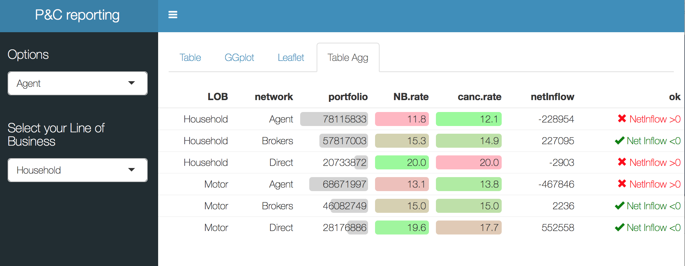

## Building an easy Shiny app step by step

The current repo show how to create a baby shiny app based on fake data step by step.


Note that 
```/data```, ```/modules``` and ```/www``` have to be copied/pasted in each application folder

Visually, the final shiny app looks like that : 

 <hr>

 <hr>

 

